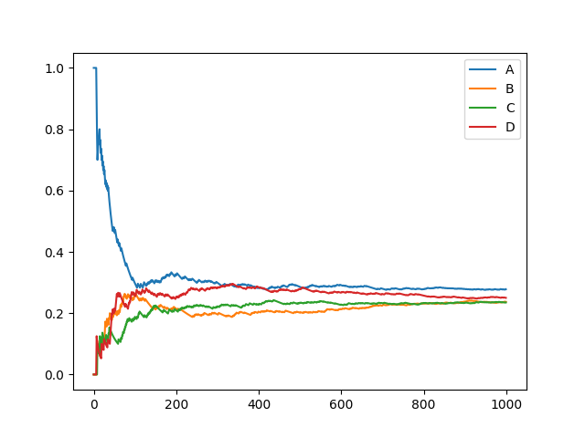

# FakeRandom

This is an example of a false choice. When the number of experiments is small, it will reflect the obvious weight. But when the number of trials tends to be infinite, it looks like an equal opportunity random selection.  

## Example

The `main.py` is a simple example.  
It defines a set of data: A, B, C, D.  
And their weight: 100,1,1,1.  

In addition, when instantiating the fakerandom object, the third parameter 100 means that the result will not reflect the weight after the 100th experiment.

After drawing the probability map, it is roughly as follows:  

  
